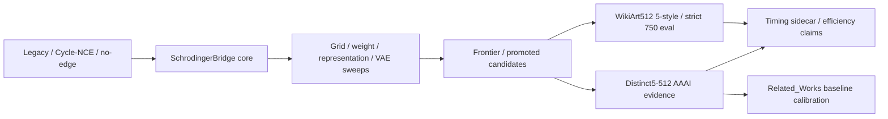

# ??????

????? CSV ??????????????????????????????????

## ???

## ????

| phase | meaning | reading |
| --- | --- | --- |
| 2026-02-15 to 2026-03-19 | ?? legacy/no-edge/Cycle-NCE ?????????? style-transfer ??????? | ?????? summary.json?training csv/log?method/dataset ?????????????? |
| 2026-03-20 to 2026-04-14 | legacy256?StyleID/IDT ???? no-tokenized/tokenized ????????? | ??????/??????? baseline ??? |
| 2026-05-07 to 2026-05-14 | LANCET/LBM ??? I: ???????????? | method ??? unknown ?? LANCET/LBM??????? SchrodingerBridge? |
| 2026-05-20 to 2026-05-29 | grid/search?weight sweep?frontier?representation probe?vae backend ????? | ?????????/?????????????? |
| 2026-05-30 to 2026-05-31 | ?? I: ????2026-05-30 ?? 2080 ???? run511?photo_monet?wikiart512 ??? LANCET/LBM/Related_Works baseline ??? | ???? curated??????? ckpt???????? |
| 2026-06-01 to 2026-06-05 | Distinct5-512?WikiArt512 ?????AAAI evidence pack?timing sidecar ???????? | ?????? claim ?????? timing master ? full-eval ??? |

## ????

- `cycle_nce` ???????????????????????????????
- `schrodingerbridge_*` ??????????? grid/weight/frontier/vae/representation ???????????????
- `distinct5_512` ? `wikiart512_5style` ????????/appendix ????????? timing evidence ?????
- `related_works_baselines` ?????????? timing ??????????? wall time?
- `unknown` ????????????????????????????????

## ?????????

- ???????`distinct5_512`?`wikiart512_5style`?`strict_protocol_750`?
- ??/???`schrodingerbridge_weight_sweep`?`schrodingerbridge_grid_search`?`schrodingerbridge_vae_backend`?`schrodingerbridge_representation_probe`?
- ?????`cycle_nce`?`legacy_style_transfer_experiments`?`legacy256_overfit50`?
- baseline ???`related_works_baselines`?`s2wat`?`run511_5domain`?`photo_monet_5x5`?

## ????

- ? method/dataset ???????????????? config/log?
- Related_Works ?????????????????
- skipped checkpoint ???????????????????? latent/cache/ckpt ???????
- ?? tex/pdf ????????????
