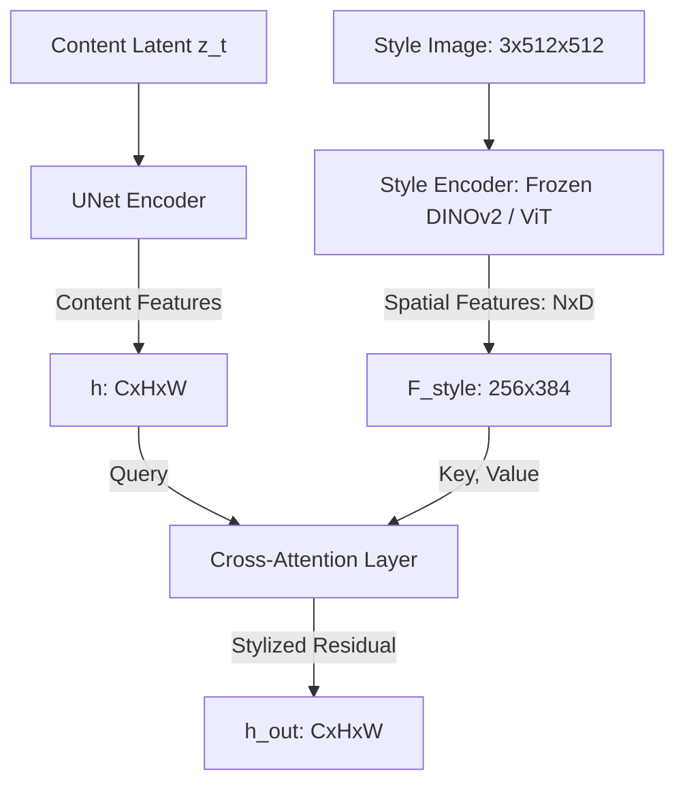

# 02 — 架构级重构方案与信息流重建

> 基于前篇的理论诊断，本篇旨在提出一套**可实现的、工业级的架构重构方案**。
> 核心目标是彻底打通被阻断的风格信息流，用确定性的离线配对取代不稳定的在线 OT，
> 最终回归最纯粹的 Flow Matching 范式。

---

## 1. 核心设计原则：极简与解耦

为了打破 style ≈ 0.70 的均值坍缩诅咒，我们需要遵循以下三个核心原则：

1. **确定性配对 (Deterministic Pairing)**：消除在线 Minibatch OT 带来的目标抖动。模型在训练时必须有一个稳定、确定的风格化目标。
2. **纯粹回归 (Pure Regression)**：消除训练中的 ODE 展开（ODE Unrolling）和复杂的 SWD 惩罚。回归最纯粹的 Flow Matching 损失：$\mathbb{E}_{t} \|v_\theta(x_t) - v_{\text{target}}\|^2$。
3. **时空解耦 (Spatiotemporal Decoupling)**：彻底分离“时间推进（破坏程度）”和“风格注入（纹理寻址）”的信息通道。

---

## 2. 离线预配对：DINOv2 驱动的潜空间传输

这是解决“Minibatch OT 跨 batch 抖动”和“均值坍缩”的最关键一步。
我们不在训练时让模型去猜应该去往哪个目标，而是在**离线预处理阶段**就把高质量的配对找出来。

### 2.1 第一步：语义弱配对 (Semantic Weak Pairing)
首先利用预训练特征，为每张内容图找到一张在语义/构图上相似的目标风格图。

* **特征提取**：利用 DINOv2 提取数据集内所有内容图 $C$ 和风格图 $S$ 的全局特征 (CLS Token)。
* **Top-K 召回**：对内容图 $C_i$，在目标风格集中计算余弦相似度，取 Top-10 到 Top-50，随机选取一张作为 $S_i$。
* **目的**：保证目标图像在宏观布局上与内容图像存在对应关系，降低速度场学习的难度，同时保证风格多样性。

### 2.2 第二步：潜空间像素级 Sinkhorn 对齐 (Optional / A-B Test)
（这是外部审查中提到的预匹配 OT 方案）
既然 VAE 的潜空间不适合被强行打碎重排（会造成解码器 checkerboard artifacts），我们如何在像素级对齐？

* **方案 A：不做像素重排（纯 Independent Coupling，推荐起点）**
  * 直接把 $Z_{\text{content}}$ 和对应的 $Z_{\text{style}}$ 作为起点和终点。
  * $v_{\text{target}} = Z_{\text{style}} - Z_{\text{content}}$
  * 依赖主干网络内的 Cross-Attention 自主学习如何把 $Z_{\text{style}}$ 的纹理搬运到 $Z_{\text{content}}$ 的正确位置。

* **方案 B：特征级空间对齐（Feature-level Spatial Alignment）**
  * 在 DINOv2 的空间特征图层面上，计算内容图和风格图 patch 之间的 Sinkhorn 最优传输计划 $\Pi$。
  * 利用 $\Pi$ 对风格图的特征进行软重组（Soft Warping），生成 $\hat{F}_{\text{style}}$，再以此作为训练的 condition。
  * **注意**：绝对不能直接 warp VAE 的潜变量 $Z$，只能 warp condition 侧的特征 $F$。

---

## 3. 信息流重建：从查表到真正的交叉注意力

必须废除当前代码中 `nn.Embedding(num_styles, D)` 的闭集查表机制，
建立从高分辨率风格图像到模型内部特征的**空间信息高速公路**。

### 3.1 理想的信息流拓扑

### 3.2 为什么这能突破均值坍缩？

当采用 True Cross-Attention 时，联络的垂直方向 $\mathcal{V}_z$ 不再是一个抽象的“均值化方向”，
而是由 Attention Map $A \propto Q K^T$ 动态决定的。
如果输入图像有一只猫的眼睛，Query 就会在风格特征中自动寻址到类似“眼睛”或特定笔触的 Key。
**这在物理上替代了原本用在线 OT 来寻找对应关系的低效逻辑。**

---

## 4. 主干网络改造：时空彻底解耦

当前模型的致命伤之一是 `style_code + time_code` 的加法混合。必须在架构上将它们彻底分开。

### 4.1 Time 注入通道：AdaLN-Zero (仅调节时间)
时间 $t$ 是一个标量，决定了“当前处于生成过程的哪一步”。它应该只调节全局的幅度。
在每一个 ResBlock 中：

$$h' = \text{ResBlock}(h \cdot (1 + \gamma(t)) + \beta(t))$$

其中 $\gamma(t), \beta(t)$ 由纯时间编码器 `time_mlp(t)` 生成。

### 4.2 Style 注入通道：Cross-Attention (仅注入风格纹理)
风格 $S$ 是一个极其复杂的空间信号。它不能被压缩进 AdaLN。
在原有的（或新增的）Attention Block 中：

$$h' = h + \text{Attention}(Q=W_q h, K=W_k F_{\text{style}}, V=W_v F_{\text{style}})$$

这样，**Time 控制了流的进度，Style 控制了流的方向。互不干扰。**

---

## 5. 极简的单步回归训练 (Single-step Regression)

彻底抛弃复杂的损失函数组合（`w_kinetic`, `terminal_swd_weight`，以及训练中的 ODE 展开）。
训练过程简化为：

1. 从预配对的数据集中加载 `(z_c, z_s, style_image)`
2. 采样 $t \sim U(0, 1)$
3. 构建直线流状态：$z_t = (1 - t) z_c + t z_s$
4. 提取风格特征：$F_s = \text{StyleEncoder}(\text{style\_image})$
5. 预测速度场：$v_{\text{pred}} = \text{Model}(z_t, t, F_s)$
6. 计算真实目标：$v_{\text{true}} = z_s - z_c$
7. **最终 Loss**：$\mathcal{L} = \| v_{\text{pred}} - v_{\text{true}} \|_2^2$

如果发现模型倾向于改变内容结构，可以加入**单步预测内容损失**（不展开 ODE）：
$$\hat{z}_1 = z_t + (1 - t) v_{\text{pred}}$$
$$\mathcal{L}_{\text{content}} = \text{L1}(\hat{z}_1, z_c) \quad (\text{weight} \approx 0.1)$$

---

## 6. 需要通过实验敲定的分歧点 (A/B Tests)

在实现上述方案时，以下几个具体的设计维度需要在初期进行 A/B 测试以确定最优路线：

### 实验 1：Style Encoder 的容量与冻结策略
我们如何获取 $F_{\text{style}}$？
* **路线 A (推荐起点)**：冻结的 DINOv2 `vit_small_patch14`。提取中间层特征。
  * **优势**：泛化极强，训练极快（不用算 encoder 梯度）。
  * **劣势**：DINO 偏向语义，可能对某些细微笔触（高频）的表征不足。
* **路线 B**：从头训练一个轻量级的 ResNet / CNN Encoder。
  * **优势**：特征空间完全为风格迁移任务定制。
  * **劣势**：增加训练参数，可能在小数据集上过拟合。

### 实验 2：交叉注意力的注入深度
网络在哪些层需要“看”风格特征？
* **路线 A**：仅在 UNet 的 Bottleneck (最深层) 注入。
  * **影响**：可能只能学到全局的色调和低频的大块风格。
* **路线 B (推荐)**：在 Decoder 的每一个分辨率层（如 32x32, 64x64, 128x128）都进行 Cross-Attention。
  * **影响**：多尺度注入。深层学色调，浅层学高频笔触（如画布纹理）。

### 实验 3：是否需要显式的结构保持机制 (Structure Preservation)
在纯 Independent Coupling (直线匹配) 下，如果 LPIPS 仍然偏高（> 0.40），如何拉回？
* **路线 A**：加入 $\text{L1}(\hat{z}_1, z_c)$ 或潜空间的 Perceptual Loss。
* **路线 B**：在模型输入通道中，直接将内容特征（如高通滤波后的边缘）作为额外的 condition channel (Concatenation)。这让模型一开始就“死死记住”边缘。
* **路线 C (推荐观察)**：什么都不加，单纯依赖模型强大的容量和直线流匹配的自发学习。InstaFlow 等研究表明，在大 batch 训练下，FM 模型会自动学到尽可能短的路径，也就是保持结构。

### 实验 4：推理时的风格超驱动 (Style Overdrive)
* **路线 A**：积分到 $t=1.0$ 停止。
* **路线 B**：利用时空解耦的优势，由于 $t$ 只代表进度不代表目标，我们可以将 ODE 积分外推至 $t=1.2 \sim 1.5$。这通常能在不显著牺牲结构的情况下，带来免费的风格增强 (Style Boost)。

---

## 7. 重构路线图与代码迁移计划

1. **预处理开发 (2 天)**：编写脚本，基于 DINOv2 特征生成 `(内容图, 目标风格图)` 的配对列表，并保存为固定文件。
2. **网络重构 (3 天)**：
   - 移除 `_compute_style_code` 中的加法。
   - 实现独立的 `AdaLN-Zero` 时间注入块。
   - 编写 `TrueCrossAttn` 模块，替换掉原有的 `style_tokens_basis` 查表法。
   - 引入 `StyleEncoder` (DINOv2) 的包裹层。
3. **流程瘦身 (1 天)**：删除所有关于 Minibatch OT、Terminal SWD、`model.integrate()` 展开求导的冗余代码。重写干净的单步 MSE 训练循环。
4. **Baseline 试跑 (2 天)**：在 `B=16` 的小规模配置下进行“实验 1”和“实验 2”的 A/B 对比。
5. **大规模训练**：确定最优组合，启动 24-epoch 训练。

下一篇文档 [03_implementation_plan.md](./03_implementation_plan.md) 将给出具体的代码修改建议和接口定义。
