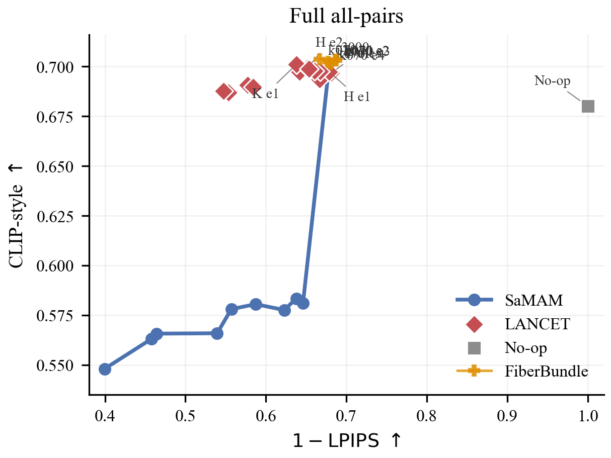
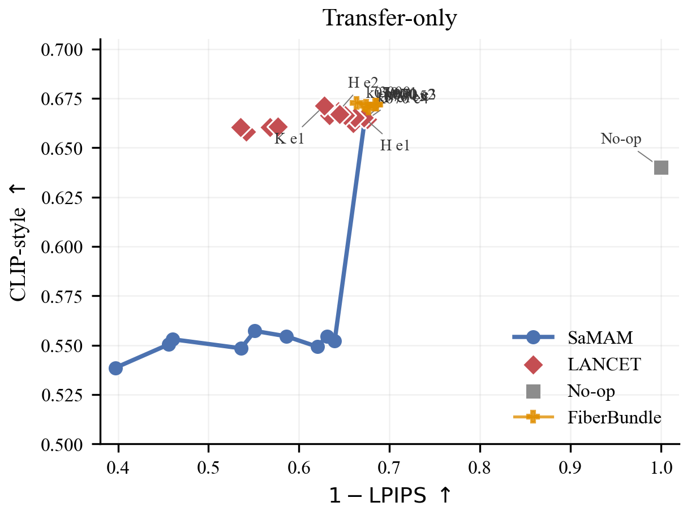

# Distinct5-512 Metric Landscape

更新时间：2026-06-02

## 图表

Full all-pairs:

Transfer-only:

原始点表：

- `tables/clip_style_vs_1lpips_points.csv`
- `tables/clip_style_vs_1lpips_full_transfer_points.csv`

矢量图：

- `figures/clip_style_vs_1lpips_full_lancet_samam_noop.pdf`
- `figures/clip_style_vs_1lpips_transfer_lancet_samam_noop.pdf`

## 口径

- 横轴：`1 - content_lpips`，越右表示内容保持越好。
- 纵轴：`clip_style`，越高表示目标风格越强。
- Full 图使用 Distinct5-512 all 5x5 / 750-image 评估。
- Transfer-only 图去掉 source style 等于 target style 的对角线，只保留 600 个非 identity transfer。
- 图上的时间标签是到达该 checkpoint 的训练 wall-time，不含 full eval 时间。
- SaMAM 曲线包含已完成评估的 250-2250 step。
- No-op reference 是把原 test 图不变地复制到所有 5x5 target 后评估得到的点；它用于显示“完全不动图像”在 CLIP-style 上的天然基线。

## 读图结论

1. LANCET 当前整体处在 SaMAM 曲线的上方：同一 Distinct5-512 口径下，LANCET 的 `clip_style` 明显更高。
2. SaMAM 曲线随训练向右移动，说明它持续降低 LPIPS；到 2250 step 时 `content_lpips=0.353820`，但 style 从 2000 的 `0.583346` 回落到 `0.581097`。
3. LANCET 的 F/H 点在横轴上领先 SaMAM 2000：F e1 为 `1-LPIPS=0.681355`，H e1 为 `0.678667`，同时 `clip_style` 约 `0.697`。
4. LANCET 的 K e1 是当前 style 最高点：`clip_style=0.700995`，但 `1-LPIPS=0.637706`，内容保持弱于 F/H。
5. No-op 5x5 点为 `clip_style=0.680123, content_lpips=0.000000`；transfer-only no-op 为 `clip_style=0.639921, content_lpips=0.000000`。这说明 Distinct5 的 CLIP-style 本身有较高同域/跨类背景相似度，论文主文需要强调 no-op reference，不能只把 LPIPS 接近 0 当作有效风格迁移。
6. Transfer-only 后，SaMAM-2250 为 `clip_style=0.552252, content_lpips=0.360452`，其判定问题是 `clip_style` 仍低于 no-op transfer 的 `0.639921`；LPIPS 只记录它确实发生了非零位移，不是该结论的失败定义。LANCET F/H/K 的 transfer style 仍显著高于 no-op。
7. 当前改进方向应从 H/F/K 的差异出发：保留 F/H 的内容保持，同时尝试吸收 K 的 style boost，并用 no-op reference 约束“只保内容不转风格”的伪优势。

## 当前关键点

| model | point | clip_style | content_lpips | 1-LPIPS | train time |
|---|---|---:|---:|---:|---:|
| No-op full | all 5x5 | 0.680123 | 0.000000 | 1.000000 | 0m |
| No-op transfer | off-diagonal | 0.639921 | 0.000000 | 1.000000 | 0m |
| SaMAM | step 2000 | 0.583346 | 0.362153 | 0.637847 | 6.8h |
| SaMAM | step 2250 | 0.581097 | 0.353820 | 0.646180 | 7.6h |
| LANCET | F e1 | 0.696915 | 0.318645 | 0.681355 | 1.2m |
| LANCET | H e1 | 0.697363 | 0.321333 | 0.678667 | 1.2m |
| LANCET | H e2 | 0.699383 | 0.348407 | 0.651593 | 2.3m |
| LANCET | K e1 | 0.700995 | 0.362294 | 0.637706 | 1.2m |

Transfer-only key points:

| model | point | clip_style | content_lpips | 1-LPIPS |
|---|---|---:|---:|---:|
| No-op | off-diagonal | 0.639921 | 0.000000 | 1.000000 |
| SaMAM | step 2250 | 0.552252 | 0.360452 | 0.639548 |
| LANCET | F e1 | 0.664360 | 0.324528 | 0.675472 |
| LANCET | H e1 | 0.665255 | 0.328105 | 0.671895 |
| LANCET | K e1 | 0.671167 | 0.372281 | 0.627719 |

## 备注

SaMAM 的 2250 结果已经补入。2250 继续向右移动但 style 略降，当前判断更明确：SaMAM 在该数据集上主要是内容保持收敛，不是风格表征变强。
