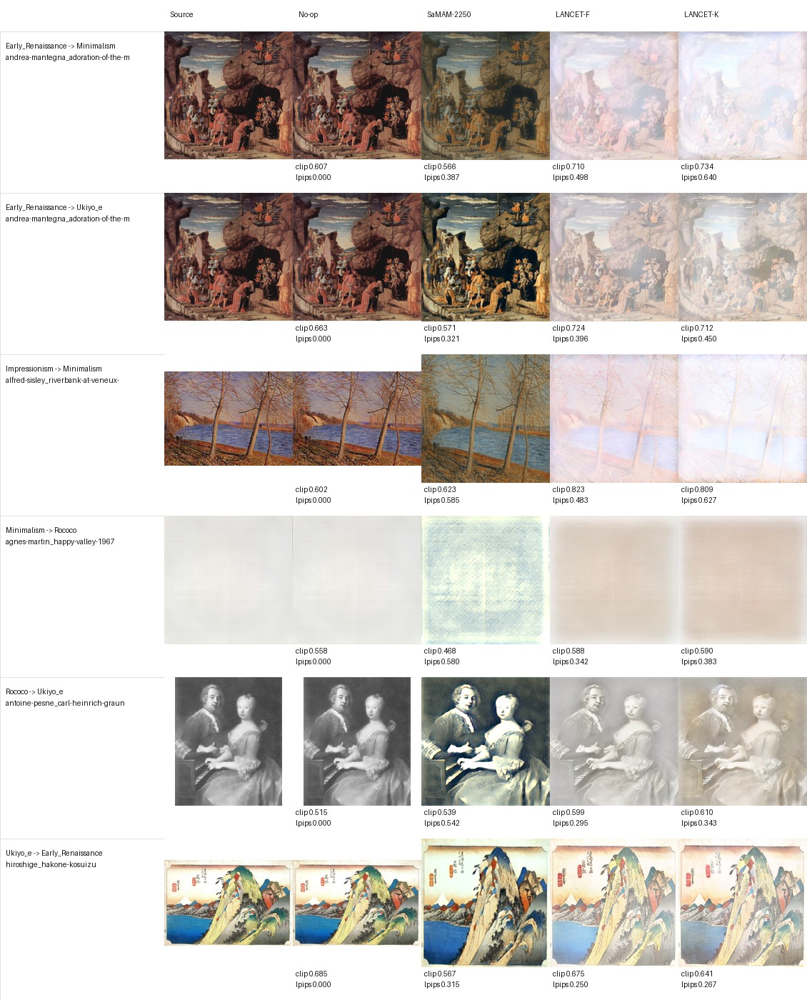

# Distinct5-512 视觉-指标一致性审查

Updated: 2026-06-02

本记录专门回应 no-op、SaMAM、LANCET 在 Distinct5-512 上出现的特殊现象：
当 `clip_style`、LPIPS、aggregate ArtFID/FID 和实际图像都指向同一个结果时，
不应简单归纳为“指标被骗”。更准确的结论是：这些指标在该数据集上共同揭示了
不同方法的真实行为差异，但它们回答的问题并不完全等同于“是否完成目标风格迁移”。

## Artifacts

- Visual comparison grid:
  `docs/experiments/distinct5_512_20260602/visual_metric_alignment_20260602/distinct5_visual_alignment_grid.jpg`
- Sample manifest:
  `docs/experiments/distinct5_512_20260602/visual_metric_alignment_20260602/distinct5_visual_alignment_manifest.json`
- Aggregate ArtFID diagnostic:
  `docs/experiments/distinct5_512_20260602/artfid_metric_hacking/distinct5_aggregate_artfid_keypoints.csv`

## Protocol

对齐同一批 transfer 样例，比较五列：

1. `Source`
2. `No-op`
3. `SaMAM-2250`
4. `LANCET-F epoch 1`
5. `LANCET-K epoch 1`

用于出图的四个方法在 600 个 transfer 样例上完全对齐；网格展示 6 个覆盖差异较大的
source-target pair。

## Visual Finding

### 1. No-op 不是生成方法，但它是强基线

No-op 图像和 source 完全一致，视觉上没有任何风格迁移。这解释了：

- LPIPS 为 `0`
- ArtFID content term 为 `0`
- aggregate ArtFID 接近 `1`

这不是“ArtFID 被骗”的完整表述。更准确地说，ArtFID/FID 在这里首先回答的是：
生成图是否仍然像真实艺术图像分布。由于 source 本身就是 WikiArt 艺术图像，
unchanged no-op 天然处在真实艺术域内，所以 aggregate ArtFID 很低。

因此，no-op 的 ArtFID 优势是指标定义和 art-to-art 数据设定共同导致的合理结果；
它只是不等价于“目标风格迁移成功”。

### 2. SaMAM 确实改了图，但目标方向不稳定

从网格看，SaMAM-2250 并不是“不动”：

- Early Renaissance -> Ukiyo-e 中，SaMAM 明显增强暗部和对比度。
- Rococo -> Ukiyo-e 中，SaMAM 给灰度肖像加了明显颜色和硬边。
- Impressionism -> Minimalism 中，SaMAM 把画面推向更冷、更粗糙的纹理。

但这些改动经常没有朝目标风格靠近，甚至降低 `clip_style`：

| pair | no-op clip | SaMAM clip | SaMAM LPIPS |
|---|---:|---:|---:|
| Early_Renaissance -> Minimalism | 0.607 | 0.566 | 0.387 |
| Early_Renaissance -> Ukiyo_e | 0.663 | 0.571 | 0.321 |
| Minimalism -> Rococo | 0.558 | 0.468 | 0.580 |
| Ukiyo_e -> Early_Renaissance | 0.685 | 0.567 | 0.315 |

这说明 SaMAM 在 Distinct5 上的失败不是“没有变化”，而是“有变化但目标表征方向不对”。
指标和视觉是一致的。

### 3. LANCET-F/K 的风格提升来自强平涂/漂白化

LANCET-F 和 LANCET-K 在多数组合上比 no-op 有更高 `clip_style`，视觉上也确实发生了
强烈变化。但这些变化目前主要体现为：

- 大幅降低局部纹理和对比度。
- 将画面推向浅色、雾化、平涂的外观。
- 对 Minimalism target 尤其有效，但会损伤可读结构。

典型例子：

| pair | no-op clip | LANCET-F clip / LPIPS | LANCET-K clip / LPIPS |
|---|---:|---:|---:|
| Early_Renaissance -> Minimalism | 0.607 | 0.710 / 0.498 | 0.734 / 0.640 |
| Impressionism -> Minimalism | 0.602 | 0.823 / 0.483 | 0.809 / 0.627 |
| Rococo -> Ukiyo_e | 0.515 | 0.599 / 0.295 | 0.610 / 0.343 |

视觉判断：LANCET 的 `clip_style` 增益不是凭空来的；它确实改变了图像测度。
但当前改变偏向“频域/色彩能量压缩”，而不是稳定地产生目标风格的结构性笔触或符号元素。

## Revised Interpretation

上一版“aggregate ArtFID 也被 no-op 骗”的说法需要收紧。

更严谨的表述：

1. no-op 的优秀 LPIPS 和 aggregate ArtFID 是真实的，因为它保留内容且仍属于艺术域。
2. 这些指标不能单独证明目标风格迁移，因为它们没有区分“保持艺术域”和“迁移到指定目标风格”。
3. SaMAM 的问题不是指标误判，而是实际视觉和 `clip_style` 都显示它在 Distinct5 上没有稳定朝目标移动。
4. LANCET 的问题也不是指标误判，而是风格移动目前过度依赖低频平涂/漂白，导致 LPIPS 和 ArtFID 代价较高。

所以，这组结果不是简单的 metric hacking；它更像是一个评估问题拆解：

- `LPIPS`：内容保持。
- `aggregate ArtFID`：是否仍像广义艺术域。
- `clip_style`：是否靠近目标风格原型。
- `visual panel`：是否产生人眼认可的目标风格结构变化。

只有四者合起来，才能解释 art-to-art 风格迁移。

## Consequences For Paper Tables

主表不应只报绝对 `clip_style` 和 LPIPS。建议报告：

1. `clip_style`
2. `content_lpips`
3. no-op `clip_style`
4. no-op-adjusted `clip_style`
5. transfer-only results
6. 一个小型视觉面板，明确展示 source/no-op/baseline/ours

aggregate ArtFID 可以保留，但应命名为 diagnostic，而不是主要胜负指标。它的作用是说明：
方法是否离开真实艺术域过远，而不是直接判定目标风格迁移是否成功。

## Model Implication

当前 Distinct5 结果对 LANCET 的直接启示：

1. LANCET-F 是目前更合理的点：LPIPS 和 aggregate ArtFID 都优于 LANCET-K，
   且 `clip_style` 仍高于 no-op。
2. LANCET-K 的 style 更强，但代价是明显漂白和结构损伤。
3. 下一步表征探索应减少“平涂化捷径”，增加可控的中高频结构变化，
   例如目标风格相关的局部 stroke/edge/texture token，而不是继续单纯推高低频色彩漂移。

## Bottom Line

这次视觉审查支持一个更强、更诚实的结论：

Distinct5-512 不是“指标全被骗了”，而是现有指标共同指出了真实问题：
no-op 是很强的艺术域/内容保持基线；SaMAM 有变化但目标方向差；
LANCET 有目标风格移动但目前过度依赖低频漂白和平涂化。论文中应把这个现象写成
art-to-art style transfer 的评价分解，而不是把所有异常都归咎于单个指标失效。
