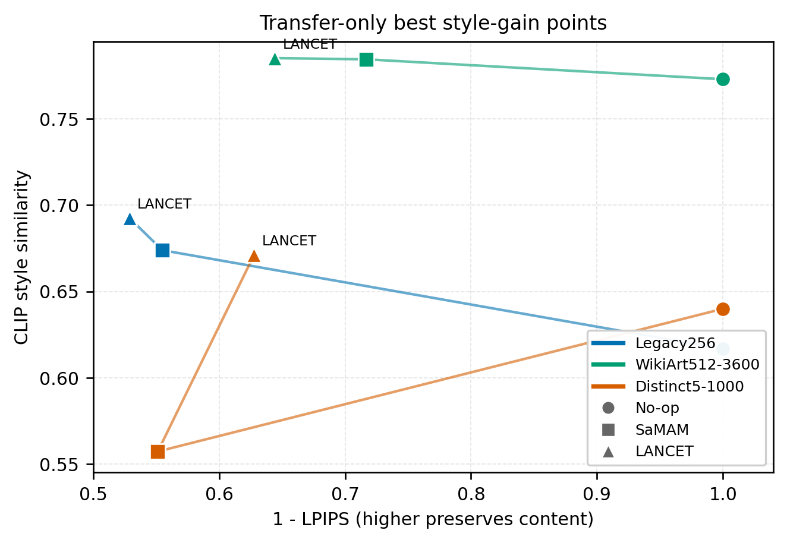

# Best Model Points vs No-op

Updated: 2026-06-02

## Figure



Data:

```text
docs/experiments/noop_comparison_across_datasets_20260602/best_transfer_vs_noop_keypoints.csv
```

Selection rule:

- scope: transfer-only, 600 off-diagonal pairs.
- no-op: standard 5x5 matrix, each row copies the same source image unchanged.
- best model point: for each dataset and method, choose the point with the largest `clip_style - no_op_clip_style`.
- WikiArt512-3600 currently has no matched LANCET point in this table.

## Best Points

| dataset | method | best point | clip_style | LPIPS | no-op clip | gain vs no-op |
|---|---|---|---:|---:|---:|---:|
| Legacy256 | No-op | unchanged | 0.616694 | 0.000000 | 0.616694 | 0.000000 |
| Legacy256 | SaMAM | 15k | 0.673892 | 0.445060 | 0.616694 | +0.057198 |
| Legacy256 | LANCET | S-add e8 | 0.692537 | 0.471155 | 0.616694 | +0.075843 |
| WikiArt512-3600 | No-op | unchanged | 0.773026 | 0.000000 | 0.773026 | 0.000000 |
| WikiArt512-3600 | SaMAM | 5k | 0.784589 | 0.283310 | 0.773026 | +0.011563 |
| Distinct5-1000 | No-op | unchanged | 0.639921 | 0.000000 | 0.639921 | 0.000000 |
| Distinct5-1000 | SaMAM | 1250 | 0.557183 | 0.448703 | 0.639921 | -0.082738 |
| Distinct5-1000 | LANCET | K e1 | 0.671167 | 0.372281 | 0.639921 | +0.031246 |

## Phenomenon

1. Legacy256: no-op is not strong. SaMAM and LANCET both produce real positive target-style gain. LANCET has the strongest gain, but pays the highest LPIPS.
2. WikiArt512-3600: no-op is already very high. SaMAM reaches the highest absolute `clip_style`, but its effective gain over no-op is only `+0.011563`.
3. Distinct5-1000: no-op is lower and the dataset is more discriminative. SaMAM falls below no-op even at its best point; LANCET remains above no-op.

## Likely Cause

The no-op baseline measures how close the unchanged source image already is to the target style domain.

- In WikiArt512-3600, the selected styles are visually close enough that unchanged art images already score around `0.77` on transfer-only `clip_style`. Absolute `clip_style` is therefore inflated.
- In Distinct5-1000, the style classes are more separated. No-op drops to `0.64`, so target-style movement becomes visible. This exposes SaMAM's failure mode: it changes the image, but not toward the target style.
- LANCET's positive gain on Distinct5 shows actual target-style movement, but current visual panels indicate that part of this gain comes from low-frequency whitening / flattening rather than stable high-frequency stroke transfer.

## Takeaway

The phenomenon is not that every metric is simply wrong. The main issue is dataset-dependent no-op strength.

For paper reporting:

- Always report no-op next to model results.
- Prefer `clip_style - no_op_clip_style` over absolute `clip_style` when comparing art-to-art transfer.
- Use Distinct5-1000 as the cleaner representation benchmark because it separates target-style transfer from generic art-domain preservation.
