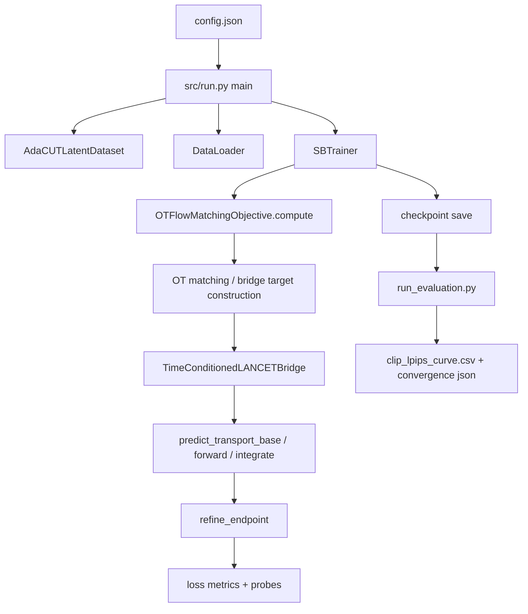

# Phase 616 LANCET Bridge Reproducible Audit

## 1. Purpose

This document is a review baseline for the current `SchrodingerBridge` model stack.

It is written for code review and experiment review, not for paper prose. The goal is:

1. Make the full training and evaluation path reproducible.
2. Make architecture changes auditable at the causal-chain level.
3. Surface failure modes where an experiment appears to change, but the model path is effectively unchanged.
4. Provide a fixed checklist for future OT / solver / conditioning refactors.

This document is intentionally more operational than elegant. If a future change cannot be re-derived from this document, the document is incomplete.

## 2. Snapshot

### 2.1 Repository snapshot

- Repo root: `G:/GitHub/Latent_Style/SchrodingerBridge`
- Base commit: `6f224c69a4c42a63874856c72b72ed73a4e4a239`
- Architecture-relevant local modified files at time of writing:
  - `docs/model/phase616_lancet_bridge_reproducible_audit.md`
  - `src/config_schema.py`
  - `src/lancet_backbone.py`
  - `src/lancet_runtime.py`
  - `src/model.py`
  - `src/losses.py`
  - `src/trainer.py`
  - `src/utils/training.py`
  - `tools/experiments/phase616_auto.py`

### 2.2 What this snapshot is trying to do

The current model family is a latent-domain style transfer bridge trained without paired examples. The intended dataflow is:

1. Sample a content latent and a target-style latent.
2. Use OT or OT-like coupling inside the batch to choose a matched target latent.
3. Train the bridge to map content toward that matched target under a selected path family:
   - linear flow matching
   - vertical flow matching
   - noisy bridge / I2SB-like bridge
4. Evaluate each checkpoint with CLIP style score and LPIPS content score.
5. Stop by eval convergence rather than fixed epoch count alone.

### 2.3 The phase-616 review question

When two experiment groups are numerically very close, there are two possibilities:

1. The theory change is weak.
2. The implementation failed to actually modify the executed model path.

This audit is built to separate those two possibilities.

## 3. Reproduction: exact commands

## 3.1 Local syntax / import sanity

Run this first after any architecture edit:

```powershell
py -3.12 -m py_compile `
  G:\GitHub\Latent_Style\SchrodingerBridge\src\config_schema.py `
  G:\GitHub\Latent_Style\SchrodingerBridge\src\lancet_backbone.py `
  G:\GitHub\Latent_Style\SchrodingerBridge\src\lancet_runtime.py `
  G:\GitHub\Latent_Style\SchrodingerBridge\src\model.py `
  G:\GitHub\Latent_Style\SchrodingerBridge\src\losses.py `
  G:\GitHub\Latent_Style\SchrodingerBridge\tools\experiments\phase616_auto.py
```

Expected result: no output and exit code `0`.

## 3.2 Minimal functional smoke: does matched-target conditioning actually affect outputs?

This is the first non-negotiable smoke test for any OT or matched-target style-conditioning edit.

```powershell
@'
import sys
from pathlib import Path
import torch

repo = Path(r'G:/GitHub/Latent_Style/SchrodingerBridge')
sys.path.insert(0, str(repo / 'src'))

from config_schema import load_experiment_config
from model import build_model_from_config

cfg = load_experiment_config(repo / 'exp/local_wsl_distinct5_512_ema_k_b16_step2min/config.json')
cfg.model.matched_target_style_encoder_mode = 'residual'
cfg.model.matched_target_style_encoder_hidden_dim = 64

model = build_model_from_config(cfg.model, bridge_cfg=cfg.bridge, use_checkpointing=False)
model.eval()

torch.manual_seed(0)
x = torch.randn(2, cfg.model.latent_channels, 32, 32)
lat_a = torch.randn_like(x)
lat_b = torch.randn_like(x)
style_id = torch.tensor([1, 1], dtype=torch.long)
t = torch.tensor([0.5, 0.5], dtype=x.dtype)

with torch.no_grad():
    out_none = model(x, t=t, style_id=style_id)
    out_a = model(x, t=t, style_id=style_id, target_style_latent=lat_a)
    out_b = model(x, t=t, style_id=style_id, target_style_latent=lat_b)
    code_a = model.encode_target_style_latent(lat_a, style_id=style_id)
    code_b = model.encode_target_style_latent(lat_b, style_id=style_id)
    base_a = model.predict_transport_base(x, t=t, style_id=style_id, target_style_latent=lat_a)
    base_b = model.predict_transport_base(x, t=t, style_id=style_id, target_style_latent=lat_b)
    end_a = model.integrate(x, style_id=style_id, num_steps=2, step_size=1.0, target_style_latent=lat_a)
    end_b = model.integrate(x, style_id=style_id, num_steps=2, step_size=1.0, target_style_latent=lat_b)

print({
    'forward_none_vs_a_mean_abs': float((out_none - out_a).abs().mean()),
    'forward_a_vs_b_mean_abs': float((out_a - out_b).abs().mean()),
    'style_code_a_vs_b_mean_abs': float((code_a - code_b).abs().mean()),
    'predict_transport_base_a_vs_b_mean_abs': float((base_a - base_b).abs().mean()),
    'integrate_a_vs_b_mean_abs': float((end_a - end_b).abs().mean()),
})
'@ | py -3.12 -
```

Observed on 2026-06-18:

```text
{
  'forward_none_vs_a_mean_abs': 0.04411177709698677,
  'forward_a_vs_b_mean_abs': 0.028536688536405563,
  'style_code_a_vs_b_mean_abs': 0.006606569979339838,
  'predict_transport_base_a_vs_b_mean_abs': 0.028536688536405563,
  'integrate_a_vs_b_mean_abs': 0.02815157361328602
}
```

Acceptance rule:

- All four deltas above should be clearly `> 0`.
- If `forward_a_vs_b ~= 0`, `predict_transport_base_a_vs_b ~= 0`, and `integrate_a_vs_b ~= 0`, then the matched target is not actually influencing the executed model path.
- If only `style_code_a_vs_b > 0` but downstream outputs stay near zero, the conditioning was computed but not consumed.

## 3.2.1 Conditioning-mode smoke

The codebase now supports explicit matched-target conditioning modes:

- `auto`
- `none`
- `spatial`
- `code`
- `both`

Observed on 2026-06-18 using the local baseline config:

```text
mode::auto::none      -> spatial_active=True,  code_active=False
mode::none::none      -> spatial_active=False, code_active=False
mode::spatial::none   -> spatial_active=True,  code_active=False
mode::code::residual  -> spatial_active=False, code_active=True
mode::both::residual  -> spatial_active=True,  code_active=True
```

And the direct forward-sensitivity check produced:

```text
none    -> 0.0
spatial -> 0.025934163480997086
code    -> 0.0
both    -> 0.028653081506490707
```

Interpretation:

- `none == 0.0` is expected.
- `spatial > 0` shows the target latent spatial path is live.
- `both > 0` shows joint conditioning is live.
- `code == 0.0` is a serious architecture clue: in the current baseline, the pure style-code path is effectively inert at initialization, which matches the phase-618 hypothesis that style-id-only conditioning is too weak.

Post-fix verification on 2026-06-18 after bypassing content-router erasure for explicit overrides:

```text
none::none       -> 0.0
spatial::none    -> 0.029088234528899193
code::residual   -> 0.0004083439416717738
both::residual   -> 0.029556237161159515
```

Updated interpretation:

- `code` is no longer exactly zero, so matched-target style-code overrides now reach the executed model path.
- But `code << spatial`, which confirms a second-order conclusion from `docs/618/why_style_weak.md`: the pure global style-code channel is real but currently much weaker than the spatial matched-target path.

Automated probe verification on 2026-06-18 using:

```powershell
py -3.12 tools/probe_conditioning_sensitivity.py `
  --config G:\GitHub\Latent_Style\SchrodingerBridge\exp\local_wsl_distinct5_512_ema_k_b16_step2min\config.json `
  --output-dir G:\GitHub\Latent_Style\SchrodingerBridge\docs\experiments\2026-06-18-conditioning-sensitivity-probe
```

Observed in `summary.json`:

```text
none::none       -> 0.0
spatial::none    -> 0.028260909020900726
code::residual   -> 0.0007190764299593866
both::residual   -> 0.027255088090896606
```

This automated probe is now the preferred regression check because it writes CSV and JSON artifacts instead of relying on one-off shell snippets.

## 3.2.2 Override-erasure smoke: is code conditioning computed but then overwritten?

This second smoke isolates the exact failure mode where a matched-target style code is successfully encoded, but then erased by later content-adaptive routing.

```powershell
@'
import sys
from pathlib import Path
import torch

repo = Path(r'G:/GitHub/Latent_Style/SchrodingerBridge')
sys.path.insert(0, str(repo / 'src'))

from config_schema import load_experiment_config
from model import build_model_from_config

cfg = load_experiment_config(repo / 'exp/local_wsl_distinct5_512_ema_k_b16_step2min/config.json')
cfg.model.matched_target_style_encoder_mode = 'residual'
cfg.model.matched_target_style_encoder_hidden_dim = 64

model = build_model_from_config(cfg.model, bridge_cfg=cfg.bridge, use_checkpointing=False)
model.eval()

torch.manual_seed(0)
x = torch.randn(2, cfg.model.latent_channels, 32, 32)
lat_a = torch.randn_like(x)
lat_b = torch.randn_like(x)
style_id = torch.tensor([1, 1], dtype=torch.long)
t = torch.tensor([0.5, 0.5], dtype=x.dtype)

with torch.no_grad():
    code_a = model.encode_target_style_latent(lat_a, style_id=style_id)
    code_b = model.encode_target_style_latent(lat_b, style_id=style_id)

    x_for_code = x / max(model.latent_scale_factor, 1e-8)
    h_c = model.enc_in_act(model.enc_in(x_for_code))
    h_c_grad = h_c
    for block in model.hires_body:
        h_c_grad = block(h_c_grad, code_a.to(dtype=h_c_grad.dtype, device=h_c_grad.device), gate=0.0)
    content_feat_16 = model.down(h_c_grad)

    adapted_a = model._adapt_style_code_from_content(
        style_id=style_id,
        style_code=code_a,
        content_feat_16=content_feat_16,
    )
    adapted_b = model._adapt_style_code_from_content(
        style_id=style_id,
        style_code=code_b,
        content_feat_16=content_feat_16,
    )

    ch = model.dec_out.in_channels
    h_dec = torch.randn(2, ch, 32, 32)
    mod_a = model.dec_mod(h_dec, code_a.to(device=h_dec.device, dtype=h_dec.dtype), gate=1.0)
    mod_b = model.dec_mod(h_dec, code_b.to(device=h_dec.device, dtype=h_dec.dtype), gate=1.0)

    out_code_a = model(x, t=t, style_id=style_id, style_code_override=code_a)
    out_code_b = model(x, t=t, style_id=style_id, style_code_override=code_b)

print({
    'encoded_code_a_vs_b_mean_abs': float((code_a - code_b).abs().mean()),
    'adapted_code_a_vs_b_mean_abs': float((adapted_a - adapted_b).abs().mean()),
    'dec_mod_code_a_vs_b_mean_abs': float((mod_a - mod_b).abs().mean()),
    'forward_code_override_a_vs_b_mean_abs': float((out_code_a - out_code_b).abs().mean()),
})
'@ | py -3.12 -
```

Observed on 2026-06-18:

```text
{
  'encoded_code_a_vs_b_mean_abs': 0.00523333577439189,
  'adapted_code_a_vs_b_mean_abs': 0.0,
  'dec_mod_code_a_vs_b_mean_abs': 0.001852113171480596,
  'forward_code_override_a_vs_b_mean_abs': 0.0
}
```

Interpretation:

- The matched-target encoder is producing different style codes.
- `dec_mod` is not constant; it does respond to different codes.
- But `_adapt_style_code_from_content(...)` collapses both overrides to the same adapted code for fixed `(content, style_id)`.
- Therefore `style_code_override` alone is currently not a reliable experiment lever in the baseline. Any experiment that claims to test dynamic instance-level style coding must first defeat this erasure path.

After the fix on 2026-06-18, the executed-path diagnostic using `style_code_override_active=True` now produces:

```text
{
  'encoded_code_a_vs_b_mean_abs': 0.006547010038048029,
  'adapted_code_a_vs_b_mean_abs': 0.006547010038048029,
  'forward_code_override_a_vs_b_mean_abs': 0.0003800866543315351,
  'predict_transport_base_code_override_a_vs_b_mean_abs': 0.0003800865379162133,
  'integrate_code_override_a_vs_b_mean_abs': 0.0003785807639360428,
  'last_style_code_path_debug': {
    'style_code_override_active': 1.0,
    'style_code_content_router_active': 0.0,
    'style_code_content_router_bypassed': 1.0,
    'style_code_content_delta_abs': 0.0,
    'style_code_adapted_abs': 0.11962981522083282
  }
}
```

Meaning:

- explicit `style_code_override` now survives adaptation unchanged
- `forward(...)`, `predict_transport_base(...)`, and `integrate(...)` all move when the override changes
- the effect is still small, so this fix validates the experiment lever but does not by itself solve weak style transfer

## 3.2.3 Automated topology no-op probe

The second major implementation trap from phase 618 is the silent no-op where:

1. `semantic_self_topology_blend > 0`
2. `semantic_self_topology_gate = false`
3. the experiment name suggests topology blending changed
4. the executed model path is identical

The same automated probe above writes `topology_sensitivity.csv` and `topology_pairwise.csv`.

Observed on 2026-06-18:

```text
gate0_blend0 style delta  -> 0.028260909020900726
gate0_blend1 style delta  -> 0.028260909020900726
gate1_blend0 style delta  -> 0.028260909020900726
gate1_blend05 style delta -> 0.017861438915133476
gate1_blend1 style delta  -> 0.028476469218730927
```

And the direct pairwise same-target deltas were:

```text
gate0_blend0 vs gate0_blend1 -> 0.0
gate1_blend0 vs gate1_blend05 -> 0.01841557025909424
gate1_blend0 vs gate1_blend1 -> 0.029391935095191002
gate0_blend1 vs gate1_blend1 -> 0.029391935095191002
```

Interpretation:

- `gate0_blend0 vs gate0_blend1 == 0.0` is hard proof that blend-only sweeps are exact no-ops when the gate is disabled.
- `gate1_blend0 vs gate1_blend1 > 0` proves the blend lever becomes live when the gate is enabled.
- Therefore any historical comparison that changed only `semantic_self_topology_blend` without enabling `semantic_self_topology_gate` is invalid as evidence about topology-guided transport.

## 3.2.4 Remote h1 config random-init probe

To avoid over-interpreting trained checkpoints, the same probe was run on the pulled remote `h1_linear_fm` config with random initialization:

```powershell
py -3.12 tools/probe_conditioning_sensitivity.py `
  --config G:\GitHub\Latent_Style\SchrodingerBridge\docs\experiments\2026-06-18-remote-h1-e18-diagnosis\remote_config.json `
  --output-dir G:\GitHub\Latent_Style\SchrodingerBridge\docs\experiments\2026-06-18-remote-h1-e18-diagnosis\probe_random_init
```

Key facts about that remote config:

- `semantic_self_topology_gate = true`
- `semantic_self_topology_blend = 1.0`
- `tokenizer_content_adaptive = false`

Observed:

```text
spatial::none  -> 0.029726596549153328
code::residual -> 0.0007738805725239217
both::residual -> 0.02729835733771324
```

And topology pairwise:

```text
gate0_blend0 vs gate0_blend1 -> 0.0
gate1_blend0 vs gate1_blend1 -> 0.031597238034009933
```

Interpretation:

- the blend no-op trap is still exact when the gate is off
- in the actual `h1` config family, the global code path is intrinsically much weaker than the spatial matched-target path even before training
- because `tokenizer_content_adaptive=false` here, this weakness is not explained by the content-router overwrite bug
- therefore "style is weak" in phase 616 is not reducible to one bug; it also reflects an architecture-level actuation imbalance

## 3.2.5 Path anatomy probe: where does no-reference style first become live?

The reusable probe now also writes:

- `path_anatomy.csv`

This isolates the first stage where two different matched-target-derived style codes begin to produce different tensors under random initialization.

Pre-repair one-off trace on 2026-06-18 for the pulled remote `h1` config showed:

```text
encoded_code_delta              -> 0.008771349675953388
first_hires_block_gate1_delta   -> 0.0
skip32_delta_gate0_path         -> 0.0
content16_delta                 -> 0.0
h_body_code_only_delta          -> 0.0
h_fused_code_only_delta         -> 0.0
h_dec_code_only_delta           -> 0.0
h_mod_code_only_delta           -> 0.0033200972247868776
delta_code_only_delta           -> 0.0005722185014747083
style_map_spatial_delta         -> 1.179891586303711
h_body_spatial_delta            -> 0.24209201335906982
```

Interpretation:

- the encoded matched-target style code was real
- but in the no-reference path the difference did not affect any executed feature tensor until `dec_mod`
- the body path remained entirely unchanged
- the spatial matched-target path, by contrast, already diverged strongly at `style_map -> h_body`

After the live-init repair on 2026-06-18, running:

```powershell
py -3.12 tools/probe_conditioning_sensitivity.py `
  --config G:\GitHub\Latent_Style\SchrodingerBridge\docs\experiments\2026-06-18-remote-h1-e18-diagnosis\remote_config.json `
  --output-dir G:\GitHub\Latent_Style\SchrodingerBridge\docs\experiments\2026-06-18-remote-h1-e18-diagnosis\probe_random_init_live_init
```

produced in `path_anatomy.csv`:

```text
code_only_no_reference:
  encoded_code_a_vs_b_mean_abs            -> 0.010176117531955242
  first_hires_block_gate1_a_vs_b_mean_abs -> 0.003666731994599104
  h_fused_a_vs_b_mean_abs                 -> 0.0013707999605685472
  h_dec_pre_mod_a_vs_b_mean_abs           -> 0.006331180687993765
  h_dec_post_mod_a_vs_b_mean_abs          -> 0.006247717421501875
  delta_a_vs_b_mean_abs                   -> 0.0009615437593311071

spatial_matched_target:
  style_map_a_vs_b_mean_abs               -> 1.175713062286377
  h_body_a_vs_b_mean_abs                  -> 0.25299525260925293
  delta_a_vs_b_mean_abs                   -> 0.02723843604326248
```

Interpretation:

- the no-reference code path is no longer entirely dormant before `dec_mod`
- skip fusion and decoder features now move under style-code changes
- but `h_body_code_only_delta` is still exactly `0.0` while `h_body_spatial_delta` remains large
- therefore the core train/eval mismatch still stands: training can rely on a strong matched-target spatial body path, while no-reference inference still lacks any body-level style actuation

This is the clearest current diagnosis of why many OT or matched-target experiments look real in training yet wash out in no-reference evaluation.

## 3.2.6 Low-rank code-map override: does no-reference style reach `h_body` at all?

To test the smallest architecture repair that can close the train/eval gap, the pulled remote `h1` config was cloned in-memory with:

```text
style_code_spatial_mode = lowrank
style_code_spatial_hidden_dim = 64
style_code_spatial_rank = 8
style_code_spatial_base_hw = 16
style_code_spatial_scale = 0.35
```

The saved artifact is:

- `docs/experiments/2026-06-18-remote-h1-e18-diagnosis/probe_lowrank_code_map_override.json`

The same probe is now reproducible directly from CLI:

```powershell
py -3.12 tools/probe_conditioning_sensitivity.py `
  --config G:\GitHub\Latent_Style\SchrodingerBridge\docs\experiments\2026-06-18-remote-h1-e18-diagnosis\remote_config.json `
  --output-dir G:\GitHub\Latent_Style\SchrodingerBridge\docs\experiments\2026-06-18-remote-h1-e18-diagnosis\probe_random_init_lowrank_cli `
  --override model.style_code_spatial_mode='"lowrank"' `
  --override model.style_code_spatial_hidden_dim=64 `
  --override model.style_code_spatial_rank=8 `
  --override model.style_code_spatial_base_hw=16 `
  --override model.style_code_spatial_scale=0.35
```

This writes:

- `summary.json`
- `path_anatomy.csv`
- `effective_config.json`

Observed:

```text
conditioning_code_forward_delta -> 0.004973988048732281
conditioning_spatial_forward_delta -> 0.026586372405290604

code_only_no_reference:
  h_body_a_vs_b_mean_abs    -> 0.05634588375687599
  delta_a_vs_b_mean_abs     -> 0.009910744614899158

spatial_matched_target:
  h_body_a_vs_b_mean_abs    -> 0.2625107765197754
  delta_a_vs_b_mean_abs     -> 0.026605140417814255
```

Interpretation:

- the low-rank code-map does what the previous architecture could not: it makes no-reference style differences reach `h_body`
- the code-only path is still weaker than the matched-target spatial path, but it is no longer body-dead
- this is the first concrete evidence that the phase-618 failure is not merely "style code too small"; it is specifically "no body-level no-reference spatial carrier"

Current-state correction note on 2026-06-18:

- a second fidelity bug in `tools/probe_conditioning_sensitivity.py` was later fixed
- the old `code_only_no_reference` anatomy trace had not replayed
  `model._compute_style_code(...)` plus `model._structured_style_from_sidecar(...)`
- for the repaired lowrank base, that older anatomy branch therefore overstated the code-only delta and understated the structured-map contribution
- the corrected local random-init artifact is now:
  - `docs/experiments/2026-06-18-current-state-conditioning-probe/README.md`
- on that current repaired-base probe:
  - `conditioning_code_forward_delta == anatomy_code_only_delta == 0.0022138171`
  - `conditioning_spatial_forward_delta == anatomy_spatial_delta == 0.0145761650`

Use those newer matched live/anatomy numbers when auditing the repaired lowrank base itself.

## 3.2.7 Config-effect differential probe: did the config diff hit the eval graph at all?

The newest reusable audit is:

```powershell
py -3.12 tools/probe_config_effectiveness.py `
  --config G:\GitHub\Latent_Style\SchrodingerBridge\docs\experiments\2026-06-18-remote-h1-e18-diagnosis\remote_config.json `
  --variant-spec G:\GitHub\Latent_Style\SchrodingerBridge\docs\experiments\2026-06-18-remote-h1-e18-diagnosis\config_effect_variants.json `
  --output-dir G:\GitHub\Latent_Style\SchrodingerBridge\docs\experiments\2026-06-18-remote-h1-e18-diagnosis\config_effect_probe `
  --device cpu
```

It compares a baseline config against named variants under four contexts:

1. `plain`
2. `configured`
3. `spatial`
4. `code`

Unlike the basic liveness probe, this one answers a stricter review question:

> Does a config delta change only the matched-target training graph, or does it also change the plain no-reference graph that the benchmark actually sees?

The probe copies all shared baseline weights into each variant before comparison. That removes random-init drift and makes the resulting deltas attributable to the config difference itself.

Baseline fact from `config_effect_probe/summary.json`:

```text
anatomy_code_body_dead_spatial_body_live -> true
```

That is the current `h1` mismatch in compact form:

- code-only no-reference style does not move `h_body`
- spatial matched-target style does

### Blend sweep verdict

Observed for `blend_0p20`, `blend_0p40`, `blend_0p60`, and `blend_0p00`:

```text
plain:
  vs_base_forward_mean_abs        -> 0.0
  style_response_forward_mean_abs -> 0.0

configured / spatial:
  blend_0p20 -> 0.02586447075009346
  blend_0p40 -> 0.021669115871191025
  blend_0p60 -> 0.016345953568816185
  blend_0p00 -> 0.029262322932481766
```

Meaning:

1. in the real pulled `h1` config, blend sweeps are not broken no-ops, because `semantic_self_topology_gate=true`
2. but they are exact no-ops in plain no-reference inference
3. therefore a blend sweep can be genuinely changing the training graph while leaving the benchmarked no-reference graph identical

This is a sharper and more useful statement than the earlier coarse warning "blend sweeps are invalid unless the gate is on." Both are true, but they diagnose different failure modes:

- `gate=false` means the sweep is globally fake
- `gate=true` plus no-reference zero spatial source means the sweep is train-only real and eval-path inert

### Low-rank code-map verdict

Observed:

```text
code_map_lowrank:
  plain vs_base_forward_mean_abs      -> 0.06238806992769241
  configured vs_base_forward_mean_abs -> 0.004142487421631813
  anatomy_code_body_dead_spatial_body_live -> false

code_map_lowrank_both:
  plain vs_base_forward_mean_abs      -> 0.10839318484067917
  configured vs_base_forward_mean_abs -> 0.007987639866769314
  anatomy_code_body_dead_spatial_body_live -> false

code_map_lowrank_both_blend_0p40:
  plain vs_base_forward_mean_abs      -> 0.10840653628110886
  configured vs_base_forward_mean_abs -> 0.023664431646466255
  anatomy_code_body_dead_spatial_body_live -> false
```

Meaning:

1. low-rank `style_code -> map_16` is the first tested config lever that materially changes the plain no-reference graph
2. once enabled, the evaluation path is no longer identical to baseline even without a matched target latent
3. therefore future OT and TopoGate reruns should be interpreted differently depending on whether they do or do not include a no-reference spatial carrier

Review rule:

- if two experiment families are close, first ask whether their config diff moves `plain`
- if `plain == 0` but `configured > 0`, the experiment changed training-time conditioning but not the benchmarked no-reference path
- if `plain > 0`, then a close result is much more likely to be a real algorithmic tie rather than a silent execution-path tie

## 3.2.8 Training-variant differential probe: did the OT / bridge hypothesis change training targets at all?

The second reusable audit is:

```powershell
py -3.12 tools/probe_training_variant_effect.py `
  --config G:\GitHub\Latent_Style\SchrodingerBridge\docs\experiments\2026-06-18-remote-h1-e18-diagnosis\remote_config.json `
  --variant-spec G:\GitHub\Latent_Style\SchrodingerBridge\docs\experiments\2026-06-18-stage1-training-effect-probe\stage1_variant_spec.json `
  --output-dir G:\GitHub\Latent_Style\SchrodingerBridge\docs\experiments\2026-06-18-stage1-training-effect-probe\probe_random_init `
  --device cpu
```

This probe fixes:

- model weights
- synthetic batch
- bridge random seed

and compares, against baseline:

1. `matched_target`
2. `objective_target`
3. `x_t`
4. `target_velocity`
5. `pred_velocity`
6. selected OT / bridge metrics

It answers a different question than `probe_config_effectiveness.py`:

- config-effect probe asks whether the benchmarked no-reference eval graph changed
- training-variant probe asks whether OT / bridge hypotheses actually changed training-time matching and bridge construction

Observed on 2026-06-18 for stage1 variants relative to `h1_linear_fm`:

```text
h0_vertical_fm:
  matched_target_vs_base_mean_abs  -> 0.0
  x_t_vs_base_mean_abs             -> 0.08638186007738113
  target_velocity_vs_base_mean_abs -> 0.30444979667663574
  classification                   -> bridge_only_change

h3_sde_noise:
  matched_target_vs_base_mean_abs  -> 0.0
  x_t_vs_base_mean_abs             -> 0.08667436987161636
  target_velocity_vs_base_mean_abs -> 0.30537015199661255
  classification                   -> bridge_only_change

h2_euclidean_ot:
  matched_target_vs_base_mean_abs  -> 0.45671725273132324
  x_t_vs_base_mean_abs             -> 0.21280144155025482
  classification                   -> ot_or_target_change

h4_unbalanced_ot:
  matched_target_vs_base_mean_abs  -> 0.06527001410722733
  ot_target_gini delta             -> +0.039943695068359375
  classification                   -> ot_or_target_change

h5_topogate_attention:
  matched_target_vs_base_mean_abs  -> 0.4015389680862427
  ot_topogate_probe_active         -> 1.0
  classification                   -> ot_or_target_change

h6_combined_topogate:
  matched_target_vs_base_mean_abs  -> 0.41072985529899597
  ot_topogate_probe_active         -> 1.0
  bridge_sigma                     -> 0.02
  classification                   -> ot_or_target_change
```

Meaning:

1. stage1 variants are not all training-path no-ops
2. `h0` and `h3` keep the same OT match as `h1` but alter bridge construction
3. `h2`, `h4`, `h5`, and `h6` materially change the matched target itself
4. therefore "all stage1 groups are close because the OT / bridge implementation never changed training" is no longer an adequate diagnosis

The missing complementary result was then measured with the config-effect probe on
the same stage1 variant family relative to `h1_linear_fm`:

```text
h0_vertical_fm        -> no_effect
h2_euclidean_ot       -> no_effect
h3_sde_noise          -> no_effect
h4_unbalanced_ot      -> no_effect
h5_topogate_attention -> no_effect
h6_combined_topogate  -> no_effect
```

Observed:

- `plain vs_base_forward_mean_abs -> 0.0`
- `configured vs_base_forward_mean_abs -> 0.0`
- `spatial vs_base_forward_mean_abs -> 0.0`
- `code vs_base_forward_mean_abs -> 0.0`

Meaning:

1. stage1 variants are real at training time
2. but they are inert on the benchmarked no-reference eval graph
3. so near-tied `h0`-`h6` curves are expected from the current contract mismatch
4. the correct conclusion is not "training never changed", but rather "the
   evaluated graph never saw those training-time differences"

Review rule:

- when metrics are close, run both the eval-graph probe and the training-variant probe
- if training probe changes but eval probe does not, the problem is train/eval contract mismatch
- if both probes change, closeness is more likely to reflect true optimization or theory limits

## 3.2.9 Current-code recheck on the repaired-lowrank stage1 family

After the earlier probe fixes, the same minimal stack was rerun on the current
local codebase for the repaired-lowrank stage1 family:

- `docs/experiments/2026-06-18-current-stage1-lowrank-recheck/README.md`

This artifact matters because it rules out a weaker objection:

> "Maybe the train/eval-contract interpretation was only true for an older local
> tree or stale probe output."

Current recheck result:

1. `probe_config_effectiveness.py` still reports
   `max_vs_base_forward_mean_abs = 0.0` for
   `h0/h2/h3/h4/h5/h6`
2. `probe_training_variant_effect.py` still reports real training-side changes:
   - `h0/h3 -> bridge_only_change`
   - `h2/h4/h5/h6 -> ot_or_target_change`
3. `h5/h6` still show:
   - `ot_topogate_probe_active = 1.0`
   - `ot_topogate_descriptor_blocks = 4`
4. `probe_conditioning_sensitivity.py` still shows the repaired-lowrank base is
   style-live but asymmetric:
   - `code -> 0.0022123`
   - `spatial -> 0.0145782`
   - `both -> 0.0155500`

So the current tree preserves the same conclusion:

- the stage1 OT family is not an implementation-wide no-op
- it is mostly a training-contract family
- the plain no-reference eval path is still not being turned into a strong
  style actuator by these overrides alone

## 3.2.10 Checkpoint-vs-init response audit: did training reroute style instead of killing it?

When a random-init probe is clearly live but trained checkpoints still cluster tightly,
the next audit should compare the trained checkpoint directly against the same config at
random initialization:

```powershell
py -3.12 tools/probe_checkpoint_style_response.py `
  --config G:\GitHub\Latent_Style\SchrodingerBridge\docs\experiments\2026-06-18-remote-h1-e18-diagnosis\remote_config.json `
  --checkpoint G:\GitHub\Latent_Style\SchrodingerBridge\docs\experiments\2026-06-18-remote-h1-e18-diagnosis\epoch_0018.pt `
  --output-dir G:\GitHub\Latent_Style\SchrodingerBridge\docs\experiments\2026-06-19-checkpoint-style-response-audit\remote_h1_epoch18 `
  --device cpu `
  --batch-size 2 `
  --latent-size 32 `
  --style-id 0 --style-id 1 --style-id 2 --style-id 3 --style-id 4
```

Authoritative artifact:

- `docs/experiments/2026-06-19-checkpoint-style-response-audit/remote_h1_epoch18/README.md`

Observed on 2026-06-19 for the pulled remote `h1_linear_fm epoch_0018.pt`:

```text
overall_reading -> matched_target_suppressed_styleid_amplified_body_dead

matched_target_spatial_forward_delta:
  init       -> 0.0272638574
  checkpoint -> 0.0006785966

matched_target_both_forward_delta:
  init       -> 0.0292907786
  checkpoint -> 0.0007176386

topology_gate1_blend_effect_delta:
  init       -> 0.0292829946
  checkpoint -> 0.0008277031

styleid_max_forward_pair_delta:
  init       -> 0.0107860174
  checkpoint -> 0.2062852979

styleid_max_body_pair_delta:
  init       -> 0.0
  checkpoint -> 0.0
```

Interpretation:

1. the trained checkpoint is not a universal no-op
2. training strongly suppresses the matched-target spatial/topology lever that was live at init
3. training strongly amplifies the plain no-reference `style_id -> decoder` lever
4. body-level no-reference style actuation still remains exactly dead

This is a more precise failure mode than either:

- "the code path never changed"
- "training suppressed all style"

The real contract on this pulled `h1` checkpoint is:

- matched-target spatial style got weaker
- topology sensitivity got weaker
- decoder-only style-id response got stronger
- no-reference `h_body` never woke up

That is why many close-result clusters should now be read as:

- style actuation learned the wrong location
- not merely "the experiment failed to touch the model"

## 3.3 Main training entry

Direct training entry:

```powershell
cd G:\GitHub\Latent_Style\SchrodingerBridge
py -3.12 src/run.py --config <config.json>
```

Main entry file: `src/run.py`

Behavior:

- Loads config.
- Validates tokenizer / bridge contract.
- Builds dataset and dataloader.
- Builds `SBTrainer`.
- Runs per-epoch training.
- Saves checkpoints.
- Optionally runs full eval each epoch.
- Optionally stops early from eval convergence.

## 3.4 Remote full-stage sweep entry

Phase-616 automated stage runner:

```bash
cd /mnt/i/Github/Latent_Style/SchrodingerBridge
python3 tools/experiments/phase616_auto.py stage1 \
  --stage-root /mnt/i/Github/Latent_Style/SchrodingerBridge/exp/20250618_lite_ot_vertical_auto \
  --skip-probe \
  --fixed-batch-size 20
```

Important defaults injected by `tools/experiments/phase616_auto.py`:

- `training.resume_checkpoint = ""`
- `training.resume_optimizer = false`
- `training.resume_training_state = false`
- `training.save_interval = 1`
- `training.full_eval_each_epoch = true`
- `training.full_eval_transfer_only = true`
- `training.full_eval_only_lpips_clip_style = true`
- `training.full_eval_stop_on_convergence = true`
- `training.full_eval_convergence_patience = 4`

This means the automation is designed for clean reruns, not resume-based continuation.

## 3.5 Full eval entry

The training loop calls full eval through `src/run.py::_run_full_eval_for_checkpoint`, which eventually executes `src/utils/run_evaluation.py`.

Equivalent manual command shape:

```bash
python3 src/utils/run_evaluation.py \
  --checkpoint <checkpoint.pt> \
  --output <run_dir/full_eval_transfer/epoch_xxxx> \
  --test_dir /mnt/i/wikiart_distinct5_samam_512_classview/test \
  --cache_dir /mnt/i/Github/Latent_Style/eval_cache \
  --clip_hf_cache_dir /mnt/i/Github/Latent_Style/eval_cache/hf \
  --transfer_only \
  --eval_only_lpips_clip_style
```

Key eval outputs:

- `full_eval_transfer/clip_lpips_curve.csv`
- `full_eval_transfer/round2_convergence.json`
- `logs/full_eval_runtime.csv`

## 4. Stage-1 experiment matrix

The current automated stage-1 sweep in `tools/experiments/phase616_auto.py` is:

| Run | Main idea | Key overrides |
| --- | --- | --- |
| `h0_vertical_fm` | vertical FM baseline | `bridge_path_mode=vertical`, `structure_only`, `self_affinity_gw`, `bridge_sigma=0.0` |
| `h1_linear_fm` | linear FM baseline | `bridge_path_mode=linear`, `structure_only`, `self_affinity_gw`, `bridge_sigma=0.0` |
| `h2_euclidean_ot` | appearance-only OT | `appearance_only`, `bridge_sigma=0.0` |
| `h3_sde_noise` | vertical + Brownian bridge noise | `structure_only`, `bridge_sigma=0.02`, `bridge_noise_schedule=exact_brownian` |
| `h4_unbalanced_ot` | unbalanced OT | `coupling_solver=sinkhorn_unbalanced`, `sinkhorn_unbalanced_tau_src=0.5` |
| `h5_topogate_attention` | TopoGate complexity OT | `appearance_plus_structure`, `topogate_attention_gw`, `coupling_structure_cost_weight=0.4` |
| `h6_combined_topogate` | unbalanced + TopoGate + noise | combine `h3`, `h4`, `h5` ideas |

This is the exact set that must be rerun whenever a conditioning bug invalidates old comparisons.

## 5. End-to-end architecture



The critical review principle is that any architecture change must be mapped onto this chain, not just onto a single module.

## 5.1 Function index for code review

These are the first functions to open when a theory change claims to affect transport, OT, or style injection.

| Responsibility | Function | Snapshot location |
| --- | --- | --- |
| trainer epoch loop | `SBTrainer.train_epoch` | `src/trainer.py:1112` |
| objective entry | `OTFlowMatchingObjective.compute` | `src/losses.py` |
| OT structure cost | `OTFlowMatchingObjective._structure_pairwise_cost` | `src/losses.py:832` |
| OT solver dispatch | `OTFlowMatchingObjective._solve_group_coupling` | `src/losses.py:1200` |
| matched-target resolution | `OTFlowMatchingObjective._resolve_matched_target_conditioning` | `src/losses.py:2088` |
| topology gate config | `TimeConditionedLANCETBridge.__init__` fields | `src/lancet_backbone.py:115-119` |
| matched-target encoder | `encode_target_style_latent` | `src/lancet_runtime.py:312` |
| content-adaptive style router | `_adapt_style_code_from_content` | `src/lancet_runtime.py:491` |
| executed transport core | `_predict_delta_from_context` | `src/lancet_runtime.py:663` |
| runtime forward wrapper | `forward` | `src/lancet_runtime.py:938` and `src/model.py:2056` |
| appearance alignment cache | `_resolve_output_appearance_context` | `src/model.py:1726` |
| proximal style token path | `_structured_proximal_style_tokens` | `src/model.py:1816` |
| endpoint refinement | `refine_endpoint` | `src/model.py:1876` |
| endpoint API | `endpoint_map` | `src/model.py:2032` |
| transport base API | `predict_transport_base` | `src/model.py:2105` |
| transport solver | `integrate_transport` | `src/model.py:2152` |
| final integration | `integrate` | `src/model.py:2254` |

If a code review skips this table and jumps straight to plots, it is too easy to miss a no-op branch.

## 6. Code-path audit by subsystem

## 6.1 Entry, config, and control plane

Primary files:

- `src/run.py`
- `src/config_schema.py`
- `tools/experiments/phase616_auto.py`

Important facts:

1. `src/run.py` is the real training entrypoint.
2. `src/config_schema.py` defines three relevant config surfaces:
   - `ModelConfig`
   - `BridgeConfig`
   - `TrainingConfig`
3. `phase616_auto.py` is not a second trainer; it is a config mutator and orchestration wrapper around `src/run.py`.

High-risk config switches:

- Model-side:
  - `tokenizer_family`
  - `solver_family`
  - `transport_prediction_mode`
  - `semantic_self_topology_blend`
  - `semantic_self_topology_gate`
  - `matched_target_conditioning_mode`
  - `matched_target_style_encoder_mode`
  - `pre_integrate_moment_match`
  - `output_moment_match`
- Bridge-side:
  - `objective_mode`
  - `bridge_path_mode`
  - `bridge_sigma`
  - `coupling_solver`
  - `coupling_cost_composition`
  - `coupling_structure_cost_mode`
  - unbalanced OT dummy settings
- Training-side:
  - `full_eval_each_epoch`
  - `full_eval_stop_on_convergence`
  - `resume_checkpoint`

Review rule:

- If a change claims to alter model behavior but only changes `phase616_auto.py`, it is only changing experiment wiring, not model architecture.

## 6.2 Dataset and batch semantics

Primary file: `src/utils/dataset.py`

Batch semantics:

- `content`: source latent
- `target_style`: randomly sampled or pairing-cache-selected target latent
- `target_style_id`: target style class id
- `source_style_id`: content style class id
- optional:
  - `aux_target_style`
  - `aux_target_valid`
  - DINO sidecars / banks

Key implementation details:

1. All epoch randomness is precomputed in `set_epoch(epoch)` for reproducibility and speed.
2. Target style sampling can be:
   - uniform
   - weighted
   - balanced per batch
   - identity-ratio controlled
3. The offline pairing cache does not directly execute OT. It narrows which target examples get sampled into a batch.
4. The actual OT used by the loss is still re-solved inside the batch.

Implication:

- There are two matching layers:
  1. dataset-level candidate restriction
  2. loss-level batch OT

If an experiment changes only one layer, it may still leave the effective matched target nearly unchanged.

## 6.3 Trainer loop

Primary file: `src/trainer.py`

Per-batch order:

1. Move batch to device.
2. Call `loss_fn.compute(...)`.
3. Backprop.
4. Optional gradient clip.
5. Optimizer step.
6. Aggregate metrics and probes.
7. Clear runtime caches.

Important review fact:

- Almost all architecture-sensitive logging comes from tensors returned by `loss_fn.compute(...)`, not from ad hoc trainer hooks.

This means if a probe is missing from the loss return dict, the trainer log will not save it no matter how correct the internal state is.

## 6.4 Objective layer: OT, bridge sampling, and losses

Primary file: `src/losses.py`

Main class:

- `OTFlowMatchingObjective`

Objective modes dispatched by `compute(...)`:

- `omf`
- `i2sb_endpoint`
- default sampled bridge flow matching

Core responsibilities:

1. Build or sample the matched target.
2. Construct the bridge state `x_t`.
3. Compute target endpoint or target velocity.
4. Call the model.
5. Compute losses.
6. Emit metrics and debug state.

### 6.4.1 OT coupling path

Main chain:

1. `_coupling_cost_matrix(...)`
2. `_structure_pairwise_cost(...)`
3. `_augment_cost_with_source_dummies(...)`
4. `_solve_group_coupling(...)`
5. `_ot_match_targets(...)`

Critical architecture fact:

- `coupling_solver=sinkhorn_unbalanced` is implemented by augmenting the target side with source-shaped dummy targets.
- That is how "allow unmatched mass" is realized in the current codebase.

### 6.4.2 Structure cost modes

Current structure cost modes include:

- `self_affinity_gw`
- `lowedge_self_affinity_gw`
- `encoder_self_affinity_gw`
- `encoder_hybrid_affinity_gw`
- `tokenizer_aux_self_affinity_gw`
- `tokenizer_aux_hybrid_affinity_gw`
- `tokenizer_entropy_affinity_gw`
- `topogate_attention_gw`

`topogate_attention_gw` is the new phase-616 direction. Its logic is:

1. Run the OT content-side probe through every semantic `body_block`.
2. Read each block's `last_topology_attn` (or `last_attn` fallback).
3. Build one 4-value complexity descriptor per block from that attention.
4. Concatenate the per-block descriptors into the final TopoGate fingerprint.
5. Build a latent affinity descriptor directly from latents.
6. Mix complexity cost and latent affinity cost by `coupling_structure_hybrid_stats_weight`.

This is important because it is the first structure cost that is explicitly trying to match transport difficulty rather than crude visual similarity.

Audit note from 2026-06-18:

- an earlier implementation effectively collapsed this mode to the **last**
  semantic body block only
- the current implementation aggregates all blocks and records
  `ot_topogate_descriptor_blocks`
- reproducible artifact:
  `docs/experiments/2026-06-18-topogate-multiblock-audit`

### 6.4.3 Training target projection

`_project_training_target(...)` can replace the raw matched target with a source-low / target-high projected target.

This means some experiments that look like "we changed OT" are in fact OT plus target projection. These two should always be analyzed separately.

### 6.4.4 Bridge noise projection

`_project_training_bridge_noise(...)` can high-pass the bridge noise itself.

This matters because a vertical-flow experiment can fail to look vertical if the noise path is still leaking low-frequency structure.

## 6.5 Backbone construction

Primary file: `src/lancet_backbone.py`

High-level shape:

1. `enc_in`: latent lift at `32x32`
2. `hires_body`: early feature blocks
3. `down`: `32 -> 16`
4. `body_blocks`: semantic attention / topology body
5. optional `blender`
6. `dec_up`
7. skip fusion
8. decoder blocks
9. output head

Two conditioning families coexist:

1. Global style code:
   - usually `FactorizedStyleTokenizer`
   - can be replaced / bypassed by structured tokenizers
2. Spatial style context:
   - structured tokenizer output
   - target latent encoding
   - proximal cross-attention style map

Phase-616 addition:

- `matched_target_style_encoder_head`

This head turns matched target encoder statistics into a style-code override candidate.

## 6.6 Runtime conditioning path

Primary file: `src/lancet_runtime.py`

This is the most important file for review because it decides what the model actually consumes.

The executed order inside `_predict_delta_from_context(...)` is:

1. Encode content latent.
2. Run zero-gate early blocks to get content features.
3. Adapt global style code from content if configured.
4. Try structured tokenizer sidecar path.
5. Cache style context for output appearance alignment / solver gates if needed.
6. Resolve spatial style source by precedence:
   - `override_palette`
   - `target_style_latent`
   - structured tokenizer / legacy `StyleMaps`
7. Run semantic body blocks.
8. Run decoder and skip fusion.
9. Compute raw latent delta.

The precedence rule above is a key review invariant. If `target_style_latent` is passed correctly, it should take precedence over legacy spatial maps in the main forward path.

There is now an explicit debug surface for this precedence:

- `style_spatial_source_override_palette`
- `style_spatial_source_target_latent`
- `style_spatial_source_structured_map`
- `style_spatial_source_legacy_zero`
- `style_spatial_map_abs`

Observed on 2026-06-18 for the local baseline:

- no `target_style_latent` -> `style_spatial_source_legacy_zero = 1`, `style_spatial_map_abs = 0`
- with `target_style_latent` -> `style_spatial_source_target_latent = 1`, `style_spatial_map_abs > 0`

This is one of the strongest explanations for weak style at eval time: the no-reference legacy path can fall all the way back to a zero spatial map.

### 6.6.1 Matched target style encoder

`encode_target_style_latent(...)` does:

1. Re-encode target latent through the same early encoder stem.
2. Compute pooled mean/std/high-pass statistics.
3. Map those stats through `matched_target_style_encoder_head`.
4. Return:
   - encoded code directly for `replace`
   - base style code plus residual delta for `residual`

This gives a dynamic instance-level style code instead of a fixed style-id lookup only.

### 6.6.2 Content-adaptive routing can erase matched-target overrides

The main pure-code failure mode is inside `_adapt_style_code_from_content(...)`.

Current behavior in the baseline:

1. `encode_target_style_latent(...)` produces different codes for different matched targets.
2. `_predict_delta_from_context(...)` immediately calls `_adapt_style_code_from_content(...)`.
3. That router uses `(content_feat_16, style_id)` and rebuilds atom weights.
4. For fixed content and fixed style id, two different overrides can collapse to the same adapted code.
5. Downstream `forward(...)` therefore becomes invariant to the matched-target code even though the encoded override itself changed.

This is not a theoretical weakness. It is an implementation-level experiment invalidator.

Current status after the 2026-06-18 fix:

- explicit `style_code_override` now bypasses content-adaptive routing
- the runtime logs:
  - `style_code_override_active`
  - `style_code_content_router_active`
  - `style_code_content_router_bypassed`
  - `style_code_content_delta_abs`
  - `style_code_adapted_abs`

Review rule:

- Any experiment using `matched_target_conditioning_mode=code` or `both` must verify that `adapted_code_a_vs_b_mean_abs > 0` under the smoke in Section 3.2.2.
- If this delta is zero, the experiment is effectively not testing dynamic style-code conditioning.
- If the delta is positive but `forward_code_override_a_vs_b_mean_abs` stays tiny relative to the spatial path, then the experiment is real but the style-code channel is simply weak.
- The fastest regression check is now `tools/probe_conditioning_sensitivity.py`, which reports both the override-bypass status and the executed forward/base/integrate deltas.

## 6.7 Model API layer

Primary file: `src/model.py`

The API split is:

- `forward(...)`: return velocity-like quantity used inside integration
- `predict_transport_base(...)`: predict transported base latent before proximal refinement
- `integrate_transport(...)`: solve the transport path
- `integrate(...)`: solve transport then run endpoint refinement
- `endpoint_map(...)`: one-shot endpoint API
- `refine_endpoint(...)`: proximal cross-attention refinement and optional output appearance alignment

This split is easy to misunderstand. A change that only affects `refine_endpoint(...)` will not necessarily change the transport field. A change that only affects `forward(...)` may not affect endpoint refinement if the endpoint path bypasses it.

### 6.7.1 Solver families

Current solver families include:

- legacy Euler-like path
- `solver_tangent_rk`
- `solver_pc`
- `solver_unsb_cycle`
- `solver_i2sb`

Review invariant:

- Every solver branch that uses transport dynamics must pass through the same conditioning payload:
  - `style_id`
  - `style_code_override`
  - `target_style_latent`

If one branch drops one of these, ablations may silently compare different execution graphs.

## 6.8 Proximal refinement

The cleaned runtime currently keeps only:

- `proximal_mode = off`
- `proximal_mode = crossattn_texture`

In `crossattn_texture`:

1. Build query from `z_base`.
2. Build key/value from style tokens or structured style map.
3. Run cross-attention.
4. Produce a proximal residual.
5. Optionally high-pass the residual.
6. Clamp residual energy relative to base transport.

This means endpoint behavior is the sum of:

- transport base
- proximal residual
- optional output appearance alignment

That decomposition must always be inspected separately.

## 6.9 Inference and eval path

Primary file:

- `src/utils/inference.py`

Important methods:

- `generation(...)`
- `generation_with_target_latent(...)`
- `transfer_style(...)`

Crucial fact:

- Inference has an explicit `target_style_latent` path.
- Therefore training bugs that drop `target_style_latent` can create a train/infer mismatch: the API exists, but the train-time main path may not actually use it.

## 7. The conditioning bugs that invalidate old OT conclusions

These are the two most important concrete findings from the audit.

### 7.1 Bug class A: matched target not reaching the executed transport path

Previous failure pattern:

1. OT matching produced a different `matched_target`.
2. The loss resolved `target_style_latent = matched_target`.
3. But the main `forward(...)` path discarded that argument before calling `_predict_delta_from_context(...)`.
4. Result: experiments could differ in OT plans while still sharing the same executed transport field.

The exact symptom class was:

- different experiment names
- different theoretical explanations
- suspiciously similar metrics
- no large change in velocity / endpoint probes

This is exactly the kind of bug that can make a research loop stall for days.

### 7.2 Bug class B: topology-blend sweep can be a silent no-op

There is now a second class of implementation trap to watch for:

1. `semantic_self_topology_blend > 0`
2. `semantic_self_topology_gate = false`
3. experiment names suggest a topology-blend sweep
4. but the sweep is actually a no-op

The runtime now emits a warning for this condition because it is otherwise too easy to miss.

### 7.3 Bug class C: matched-target style code can be overwritten by content routing

Observed failure pattern:

1. OT changes the matched target.
2. `encode_target_style_latent(...)` changes the style-code override.
3. `_adapt_style_code_from_content(...)` recomputes atom weights from content statistics.
4. The recomputed code becomes identical across different matched targets for the same `(content, style_id)`.
5. A "code-conditioning" experiment therefore degenerates back to content-conditioned style-id lookup.

This bug class is especially dangerous because the logs may still show:

- `matched_target_style_code_active = 1`
- nonzero `matched_target_style_code_abs`

while the executed field is unchanged.

That is why Section 3.2.2 compares:

1. encoded code delta
2. adapted code delta
3. decoder modulation delta
4. final forward delta

All four are needed. Looking only at the encoded code would produce a false sense of progress.

This bug class has now been fixed for explicit overrides by bypassing content-adaptive routing when `style_code_override` is active. The probe remains necessary because future refactors can easily reintroduce the same pathology.

### 7.4 Bug class D: output-appearance cache used unresolved style maps

Observed implementation pattern before the 2026-06-18 fix:

1. `_predict_delta_from_context(...)` computed `style_code`
2. it cached `style_maps` immediately for downstream output-appearance / solver use
3. only after that did it resolve the actual active spatial source:
   - `target_style_latent`
   - `override_palette`
   - structured map
   - legacy zero
4. therefore cached output-style context could miss the real `style_map_proj` entirely

Implication:

- even when training used a strong matched-target spatial map in the semantic body
- downstream output-appearance alignment and related consumers could still see an empty `StyleMaps.map_16`

Current status:

- the cache is now written after spatial-source resolution using the actual resolved `style_map_proj`
- the no-reference fallback path now also synthesizes `StyleMaps.map_16` from the low-rank code-map when enabled
- the legacy proximal branch also adds the low-rank code-map to its internal style map

Probe verification on 2026-06-18 from `probe_random_init_post_cache_fix_v2/summary.json`:

```text
spatial mode:
  style_spatial_map_abs         -> 0.9807956218719482
  cached_output_style_map_abs   -> 0.9807956218719482

both mode:
  style_spatial_map_abs         -> 0.9874134063720703
  cached_output_style_map_abs   -> 0.9874134063720703
```

Before the fix, these cached maps could be empty even though the active spatial source was `target_style_latent`.

Additional direct verification on 2026-06-18 with `style_code_spatial_mode=lowrank`:

```text
appearance_map_present -> true
appearance_map_abs     -> 0.06679472327232361
proximal_map_abs       -> 0.7689206600189209
```

This confirms that no-reference endpoint consumers no longer fall back to an empty spatial style context when the low-rank code-map repair is enabled.

Review rule:

- if a change depends on output-appearance spatial statistics, inspect whether the cached style context contains the resolved map rather than the pre-resolution placeholder

### 7.5 Bug class E: TopoGate OT descriptor silently collapsed to the last body block

Observed implementation pattern before the 2026-06-18 fix:

1. `topogate_attention_gw` ran a probe through the semantic body
2. it then read only `model.last_semantic_topology_attn`
3. that property reflects the last populated body-block cache
4. earlier blocks were therefore discarded from the OT structure descriptor

Why this matters:

- phase-616 theory/docs described TopoGate attention as an internal structure
  fingerprint for transport difficulty
- the old implementation answered a narrower question: "what does the last body
  block think?"
- h5/h6 could therefore look closer to h0/h4 than intended, even when the OT
  mode was technically active

Current status after the fix:

- `_ot_topogate_complexity_descriptor(...)` now collects descriptors from every
  `body_block`
- the runtime exports `ot_topogate_descriptor_blocks`
- on the repaired low-rank audit base this currently reports `4.0`

Review rule:

- if `coupling_structure_cost_mode="topogate_attention_gw"`, inspect
  `ot_topogate_descriptor_blocks`
- on multiblock semantic bodies, a value of `1` should be treated as suspicious
  unless the architecture truly has only one semantic body block

## 8. Review invariants that must always hold

## 8.1 Matched target conditioning invariants

If a run claims to use matched-target instance conditioning, all of the following must hold:

1. `losses.py` resolves `target_style_latent` from `matched_target`.
2. If encoder mode is active, `style_code_override` is also resolved from `matched_target`.
3. `model.forward(...)` consumes `target_style_latent`.
4. `model.predict_transport_base(...)` consumes `target_style_latent`.
5. `model.integrate_transport(...)` passes `target_style_latent` into every solver branch.
6. `model.integrate(...)` preserves the same conditioning into refinement.
7. If `style_code_override` is used, content-adaptive routing must not collapse distinct overrides to the same executed code unless that behavior is explicitly intended and logged.

## 8.2 OT experiment validity invariants

If an experiment claims to test OT quality, then changing OT must modify at least one of:

1. the matched target
2. the style code override
3. the spatial style source
4. the transport state trajectory
5. the terminal endpoint

If none of these move, it is not an OT experiment; it is a bookkeeping difference.

## 8.3 Eval-stop invariants

If `full_eval_stop_on_convergence=true`, then:

1. `full_eval_each_epoch` must also be true
2. `full_eval_defer_until_training_end` must be false

Otherwise the stop flag exists only on paper.

## 9. Probe inventory: what to inspect after every architecture change

Primary logging sink: training CSV and epoch log from `src/trainer.py`

Recommended minimum probe set:

- checkpoint-vs-init contract:
  - `overall_reading` from `tools/probe_checkpoint_style_response.py`
  - `matched_target_spatial_forward_delta`
  - `matched_target_both_forward_delta`
  - `topology_gate1_blend_effect_delta`
  - `styleid_max_forward_pair_delta`
  - `styleid_max_body_pair_delta`
- OT distribution:
  - `ot_target_gini`
  - `ot_target_mass_entropy`
  - `ot_target_max_mass`
  - `ot_dummy_mass`
  - `ot_dummy_active`
- OT structure:
  - `ot_structure_cost_mean`
  - `ot_topogate_probe_active`
  - `ot_topogate_descriptor_blocks`
  - `ot_topogate_complexity_cost_mean`
  - `ot_topogate_complexity_term_var`
  - `ot_latent_affinity_cost_mean`
  - `ot_latent_affinity_term_var`
  - `ot_total_cost_matrix_var`
- bridge / dynamics:
  - `kinetic_energy`
  - `curvature`
  - `base_structural_drift`
  - `fiber_energy_ratio`
  - `low_freq_leak`
- semantic body:
  - `semantic_attn_mean`
  - `semantic_topology_attn_entropy`
  - `semantic_topology_attn_active`
- conditioning path:
  - `matched_target_style_latent_active`
  - `matched_target_style_code_active`
  - `matched_target_style_code_abs`
  - `adapted_style_code_abs` if available
  - `style_spatial_source_target_latent`
  - `style_spatial_source_legacy_zero`
  - `style_spatial_map_abs`
- endpoint decomposition:
  - `base_endpoint_abs`
  - `final_endpoint_abs`
  - `proximal_residual_abs`
  - `proximal_to_transport_ratio`

If a paper-level claim is made without looking at these families together, the diagnosis is underdetermined.

## 10. Recommended review protocol for future edits

For any change touching OT, solver, tokenizer, or endpoint refinement:

1. Run `py_compile`.
2. Run the matched-target local smoke in Section 3.2.
3. Save the raw output numbers in the change log.
4. Run one clean stage-1 rerun from a fresh stage root.
5. Confirm each epoch writes:
   - training CSV
   - `clip_lpips_curve.csv`
   - `round2_convergence.json`
6. Compare not only final best score, but also:
   - first-epoch movement
   - OT mass probes
   - topology probes
   - matched-target conditioning probes

If step 2 fails, do not trust any stage result.

## 11. Known architecture tensions

These are not bugs by themselves, but they are the most likely places for future bugs or false conclusions.

### 11.1 Two style channels coexist

There is both:

1. a global style code channel
2. a spatial style source channel

Many experiments unintentionally modify only one of them.

### 11.2 OT can be strong while conditioning is weak

The OT solver can produce a sharp plan, but if matched-target information does not reach `forward(...)`, training still behaves like style-id-only conditioning.

### 11.3 Dataset pairing cache and in-loss OT are different layers

Changing the dataset pairing cache can change the batch composition without changing the OT solver itself.

### 11.4 Endpoint quality is not transport quality

A better `refine_endpoint(...)` can improve final images while hiding a weak transport field.

### 11.5 Vertical-flow experiments are sensitive to noise projection

If the bridge noise is not projected in a compatible way, vertical constraints can be visually weakened even when the path mode says "vertical".

### 11.6 Many style-side modules start effectively asleep

Multiple style-side heads and residual gates are zero-initialized or near-zero initialized, including:

- output appearance head tails
- style injectors and carrier-gate injectors
- several style-delta / style-section outputs
- proximal output layers
- attention `gamma` gates

This is not automatically wrong. But it means weak style gradients can leave large parts of the style-actuation stack near identity for many epochs.

That matters for phase 616 because it creates a plausible path where:

1. the transport objective already favors content safety
2. the style branch starts near zero actuation
3. early training reinforces the content-preserving fixed point
4. later OT or topology changes appear to do almost nothing

### 11.7 Train/infer style mismatch is structural, not just scalar

The current `h1`-family execution graph has:

1. training-time matched-target spatial conditioning that strongly changes `style_map` and `h_body`
2. no-reference inference that can fall back to `style_spatial_source_legacy_zero`
3. a no-reference style-code path that, even after live-init repair, still does not change `h_body`

This means many OT improvements can be real in the training graph but weakly expressed in the test graph.

That is not a metric problem. It is a contract mismatch between:

- the conditioning path the optimizer sees
- the conditioning path the evaluator uses

The new low-rank code-map override reduces this mismatch by giving no-reference inference its own body-level spatial carrier, while still allowing matched-target spatial conditioning to dominate during training.

The new config-effect probe makes this mismatch directly testable:

- blend-only variants move `configured` / `spatial`
- the same variants leave `plain` exactly unchanged
- low-rank code-map variants move `plain` and flip `anatomy_code_body_dead_spatial_body_live` to `false`

That is now the fastest way to distinguish:

1. a real algorithmic tie
2. a train-graph-only change
3. a genuine no-reference eval-graph change

The new checkpoint-vs-init audit shows the mismatch can also sharpen during training,
not just exist at initialization. On the pulled remote `h1` checkpoint, training drove:

- matched-target spatial response down to about `2.5%` of init
- topology-blend response down to about `2.8%` of init
- no-reference `style_id` forward separation up by about `19x`
- `styleid_max_body_pair_delta` still to exactly `0.0`

So the model can absolutely "learn style" while still learning it in the wrong place.
That is the current best explanation for close metric clusters that are not implementation no-ops.

## 12. What to re-check first when results are suspiciously close

When two experiment groups look too similar, inspect in this order:

1. Did the intended config diff actually enter the run directory `config.json`?
2. Did the changed config alter `plain`, `configured`, `spatial`, or `code` in `tools/probe_config_effectiveness.py`?
3. If you already have a checkpoint, did `tools/probe_checkpoint_style_response.py` report:
   - `trained_style_suppression`
   - `trained_style_amplification`
   - or `matched_target_suppressed_styleid_amplified_body_dead`?
4. If only `configured` changed, did the experiment modify training-time matched-target conditioning while leaving the no-reference eval graph untouched?
5. Did `tools/probe_training_variant_effect.py` show a real change in `matched_target`, `objective_target`, `x_t`, or `target_velocity`?
6. If `topogate_attention_gw` was involved, did `ot_topogate_descriptor_blocks` confirm multiblock coverage rather than an accidental last-block-only path?
7. If the training probe stayed flat, did the changed config alter the loss branch being executed at all?
8. Did `matched_target` change?
9. Did `matched_target_style_code_active` become `1` when expected?
10. Did `forward_a_vs_b` style smoke stay `> 0`?
11. Did `adapted_code_a_vs_b_mean_abs` stay `> 0`, or did content routing erase the override?
12. Did solver branches preserve `target_style_latent`?
13. Did endpoint refinement dominate so strongly that transport differences got washed out?

This order catches "no real model change" faster than staring at CLIP-S curves.

## 13. Bottom line

The model is not one mechanism. It is a stack of partially coupled mechanisms:

1. dataset candidate selection
2. in-batch OT matching
3. bridge-path construction
4. global style coding
5. spatial style injection
6. transport solver
7. proximal endpoint refinement
8. output appearance alignment
9. full-eval early stopping

Most confusing failures happen when a change lands in only one layer but the experiment is interpreted as if it changed the whole stack.

That is why future reviews should use this document as a checklist, not as background reading.

## 14. 2026-06-18 code-level follow-up: exact `h0` family audit and runtime mirror gap

After the earlier exact-family smoke pass accidentally ran with only two config files,
the full generated stage1 family was rerun relative to the real generated
`h0_vertical_fm` baseline:

- audit root:
  `docs/experiments/2026-06-18-stage1-exact-family-audit-h0full`
- baseline:
  `docs/experiments/2026-06-18-stage1-exact-family-audit/generated_configs/h0_vertical_fm/config.json`

The full manifest now correctly includes:

- `h1_linear_fm`
- `h2_euclidean_ot`
- `h3_sde_noise`
- `h4_unbalanced_ot`
- `h5_topogate_attention`
- `h6_combined_topogate`

The training-effect summary confirms:

- `h1` and `h3` are `bridge_only_change`
- `h2`, `h4`, `h5`, and `h6` are `ot_or_target_change`
- `h5/h6` really activate `ot_topogate_probe_active = 1.0`

So the old OT family is not a training-time no-op.

One more follow-up from the same audit matters for h5/h6 interpretation:

- before the 2026-06-18 multiblock fix, `topogate_attention_gw` effectively
  consumed only the last semantic body block
- after the fix, it aggregates all body blocks and records
  `ot_topogate_descriptor_blocks`
- therefore any earlier h5/h6 artifact predating that fix should be treated as
  stale if it is used to support claims about the intended TopoGate descriptor

The code audit then exposed a separate implementation issue on the inference side:

- `src/model.py::build_model_from_config()`
- `src/model.py::_attach_bridge_runtime_fields()`

Before the 2026-06-18 follow-up fix, the model builder only mirrored a partial subset
of bridge runtime fields into the instantiated inference model. In particular,
`bridge_noise_schedule` was read by `TimeConditionedLANCETBridge.__init__()` through
`getattr(bridge_config, ...)`, but was not being copied over by
`_attach_bridge_runtime_fields()`.

That bug is now fixed, and `tools/probe_config_effectiveness.py` also records:

- `bridge_noise_schedule`
- `bridge_sigma`

However, the larger conclusion still stands:

1. stage1 OT variants are real in the training graph
2. the benchmarked no-reference eval graph still stays flat across `h0`-`h6`
3. this is not just a missing-config mirror bug
4. it is mainly because OT construction and bridge-path sampling live in
   `src/losses.py`, while the public inference calls
   `forward() / predict_transport_base() / integrate()` do not consume the OT family
   or bridge-path family as direct runtime switches

So the correct reading of near-tied stage1 curves is:

- not "nothing changed anywhere"
- but "the changes mostly lived in the training objective, while the evaluated
  no-reference graph remained almost the same contract"
